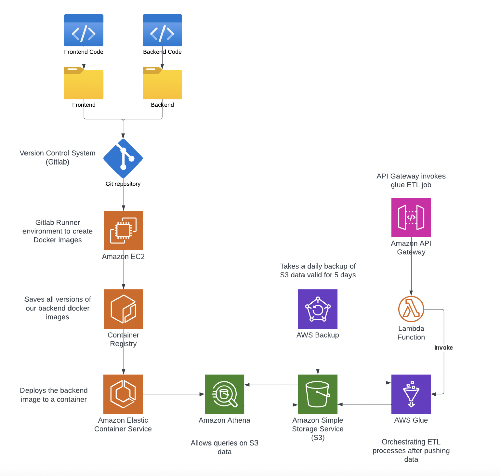

# Ocean Watch

## Description

OceanWatch is a project focused on collecting, analyzing, and sharing vital water quality data for California's coastal regions. It aims to deepen understanding of oceanic ecosystems and serves as a central hub for environmental data through the Ocean Data Lab Results project. Leveraging datasets from the California Department of Water Resources, it offers an Android application for seamless access to comprehensive water quality information.

## Aim of the Project

The aim is to centralize and provide accessible water quality information for California's coastal regions, promoting awareness of oceanic ecosystem preservation and education.

## Architecture 


## Folder Structure 
```
aws/
  ├── lambda_function.py
  └── cloudformation.yaml

backend/
  └── backendapi/
      ├── Dockerfile
      ├── requirements.txt
      └── server.py

frontend/
  ├── app/
  │   ├── .idea/
  │   │   └── inspectionProfiles/
  │   ├── gradle/
  │   │   ├── wrapper/
  │   │   │   ├── gradle-wrapper.jar
  │   │   │   └── gradle-wrapper.properties
  │   │   └── libs.versions.toml
  │   └── src/
  │       ├── androidTest/
  │       ├── main/     ...     (Contains app code)
  │       └── test/     ...     (Contains test cases)
  └── README.md
```

## End users

Diverse users include oceanographic industries, environmental researchers, chemists, educational institutions, regulatory agencies, and the public.

## Performance Targets

Clear, measurable targets ensure progress tracking, accountability, and continuous improvement in environmental monitoring and data management.

## Choice of appropriate service
Utilizing AWS services like EC2, ECS, S3, Athena, and API Gateway ensures efficient deployment, storage, querying, and management of data.

## Description

The architecture involves frontend and backend code integration, version control with GitLab, Docker image creation, storage in Amazon EC2, deployment with ECS, and data management with AWS Athena, Backup, and Glue.


## Programming Language Selection and Data Store

The Android application is built using Kotlin, Retrofit for API calls, and Flask for a REST API in Python, ensuring productivity, flexibility, and scalability.


## Ensuring Data Security Across Application Layers

Implementing end-to-end encryption, access control, authentication, and secure communication protocols ensures data security throughout the application.

## Cloud Deployment Model 

OceanWatch utilizes a public cloud deployment model to host its infrastructure and services. By leveraging the capabilities of public cloud providers like Amazon Web Services (AWS), OceanWatch benefits from scalability, flexibility, and cost-effectiveness.

## Cloud Delivery Model: SaaS (Software as a Service)

OceanWatch adopts a Software as a Service (SaaS) delivery model to provide its water quality data analysis and dissemination platform. As a SaaS solution, OceanWatch offers its services directly to users over the internet, eliminating the need for users to install, maintain, or manage any software or infrastructure locally.

## Deployment on Amazon Web Services (AWS)

OceanWatch leverages AWS services such as Amazon EC2 for virtual machine hosting, Amazon S3 for scalable object storage, Amazon ECS for container orchestration, and Amazon Athena for querying data stored in S3. These services enable OceanWatch to build a robust, scalable, and secure infrastructure to support its operations.

## Future Scalability

As OceanWatch continues to grow and expand its user base, the public cloud deployment model provides the flexibility to scale resources dynamically to meet increasing demand. This ensures that the project can adapt to evolving requirements and continue to deliver high-quality services to its users.

## Contact

For any inquiries or assistance, please contact sanjanarampurkottur01@gmail.com.
